# Database Schema Diagram

## Abcotronics ERP Modular Database Schema

```mermaid
erDiagram
    User {
        string id PK
        string email UK
        string name
        string passwordHash
        string provider
        string role
        string status
        string invitedBy
        datetime lastLoginAt
        datetime createdAt
        datetime updatedAt
    }

    Team {
        string id PK
        string name
        datetime createdAt
        datetime updatedAt
    }

    Membership {
        string userId PK,FK
        string teamId PK,FK
        string role
    }

    Client {
        string id PK
        string name
        string type
        string industry
        string status
        string stage
        float revenue
        float value
        int probability
        datetime lastContact
        string address
        string website
        string notes
        string contacts
        string followUps
        string projectIds
        string comments
        string sites
        string contracts
        string activityLog
        string billingTerms
        string ownerId FK
        datetime createdAt
        datetime updatedAt
    }

    Project {
        string id PK
        string clientId FK
        string name
        string description
        string clientName
        string status
        datetime startDate
        datetime dueDate
        float budget
        float actualCost
        int progress
        string priority
        string type
        string assignedTo
        string tasksList
        string taskLists
        string customFieldDefinitions
        string documents
        string comments
        string activityLog
        string team
        string notes
        string ownerId FK
        datetime createdAt
        datetime updatedAt
    }

    Employee {
        string id PK
        string employeeNumber UK
        string name
        string email UK
        string phone
        string position
        string department
        datetime employmentDate
        string idNumber
        string taxNumber
        string bankName
        string accountNumber
        string branchCode
        float salary
        string status
        string address
        string emergencyContact
        string ownerId FK
        datetime createdAt
        datetime updatedAt
    }

    Opportunity {
        string id PK
        string clientId FK
        string title
        string stage
        float value
        string ownerId FK
        datetime createdAt
        datetime updatedAt
    }

    Invoice {
        string id PK
        string clientId FK
        string projectId FK
        string invoiceNumber UK
        string clientName
        datetime issueDate
        datetime dueDate
        string status
        float subtotal
        float tax
        float total
        float balance
        string items
        string notes
        string ownerId FK
        datetime createdAt
        datetime updatedAt
    }

    Task {
        string id PK
        string projectId FK
        string parentTaskId FK
        string title
        string status
        string assigneeId FK
        datetime dueDate
        datetime createdAt
        datetime updatedAt
    }

    TimeEntry {
        string id PK
        string projectId FK
        datetime date
        float hours
        string projectName
        string task
        string description
        string employee
        boolean billable
        float rate
        string ownerId FK
        datetime createdAt
        datetime updatedAt
    }

    AuditLog {
        string id PK
        string actorId FK
        string action
        string entity
        string entityId
        string diff
        datetime createdAt
    }

    Invitation {
        string id PK
        string email UK
        string name
        string role
        string token UK
        string status
        string invitedBy
        datetime expiresAt
        datetime acceptedAt
        datetime createdAt
        datetime updatedAt
    }

    Feedback {
        string id PK
        string userId FK
        string pageUrl
        string section
        string message
        string type
        string severity
        string meta
        datetime createdAt
    }

    %% Relationships
    User ||--o{ Membership : "belongs to"
    Team ||--o{ Membership : "has"
    User ||--o{ Client : "owns"
    User ||--o{ Project : "owns"
    User ||--o{ Task : "assigned to"
    User ||--o{ AuditLog : "performs"
    User ||--o{ Feedback : "submits"
    
    Client ||--o{ Project : "has"
    Client ||--o{ Invoice : "receives"
    Client ||--o{ Opportunity : "has"
    
    Project ||--o{ Task : "contains"
    Project ||--o{ Invoice : "generates"
    Project ||--o{ TimeEntry : "tracks"
    
    Task ||--o{ Task : "has subtasks"
```

## Key Relationships Summary

### Core Business Entities
- **User**: Central entity managing authentication, roles, and ownership
- **Client**: Represents both clients and leads with AIDIA stages
- **Project**: Work items associated with clients
- **Employee**: HR management for internal staff

### Financial Management
- **Invoice**: Billing and payment tracking
- **TimeEntry**: Time tracking for billing and project management
- **Opportunity**: Sales pipeline management

### Project Management
- **Task**: Hierarchical task management with subtasks
- **Project**: Central project entity with JSON fields for flexibility

### System Management
- **Team**: Group management with role-based access
- **Membership**: Many-to-many relationship between users and teams
- **AuditLog**: System activity tracking
- **Invitation**: User invitation system
- **Feedback**: User feedback collection

### Key Design Patterns
1. **JSON Fields**: Many entities use JSON strings for flexible data storage (contacts, tasks, documents, etc.)
2. **Owner Pattern**: Most entities have an `ownerId` for access control
3. **Audit Trail**: Comprehensive logging through AuditLog
4. **Soft Relationships**: Many relationships are maintained through JSON arrays rather than foreign keys for flexibility
5. **Stage Management**: Clients use AIDIA stages for lead progression

### Database Type
- **SQLite**: Lightweight, file-based database suitable for development and small-to-medium deployments
