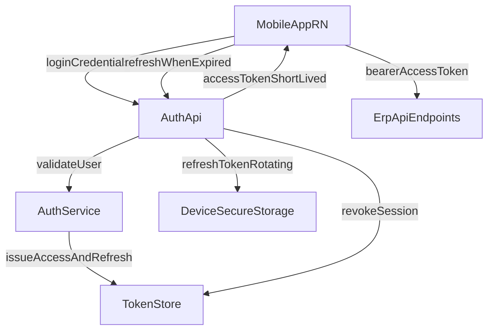

# Mobile Auth and Session Design (React Native)

This design provides a mobile-safe auth model while preserving existing web behavior.

## Goals

- Keep web auth flow stable.
- Add first-class mobile auth/session flow.
- Support secure token storage and revocation.
- Minimize backend rewrites by layering new endpoints on existing auth services.

## Proposed Architecture

## Token Model

- Access token:
  - lifetime: 10-15 minutes,
  - used in `Authorization: Bearer <token>`.
- Refresh token:
  - rotating token per refresh,
  - stored only in secure device storage,
  - linked to device session id.

## Session Lifecycle

1. User logs in via mobile endpoint and receives access + refresh token.
2. App stores refresh token in secure storage.
3. API calls use access token.
4. On expiry, app calls mobile refresh endpoint.
5. Server rotates refresh token and invalidates the previous token.
6. Logout revokes device session and clears secure storage.

## Device Session Table (Proposed)

| Field | Purpose |
|---|---|
| `id` | session id |
| `userId` | owner |
| `deviceId` | mobile installation identifier |
| `platform` | android or ios |
| `refreshTokenHash` | hashed token storage |
| `expiresAt` | refresh session expiry |
| `revokedAt` | revocation marker |
| `lastSeenAt` | security and support visibility |

## Backend Endpoints (Proposed)

- `POST /api/auth/mobile/login`
- `POST /api/auth/mobile/refresh`
- `POST /api/auth/mobile/logout`
- `POST /api/auth/mobile/revoke-device`
- `GET /api/auth/mobile/sessions`

## React Native Client Rules

- Use secure storage for refresh token and minimal session metadata.
- Keep access token in memory when possible.
- Centralize refresh retry logic in a single API client layer.
- Force sign-out on invalid refresh response or revoked session.

## Risk Controls

- Reuse existing role/permission middleware after token verification.
- Add audit logs for login, refresh, revoke-device, logout.
- Add soft rollout flag to enable mobile auth per environment.

## Acceptance Criteria

- Mobile login/refresh/logout works with token rotation.
- Existing web login behavior remains unchanged.
- Revoking a device session blocks subsequent refresh requests.
- Security logs include user, device id, and source IP metadata.

