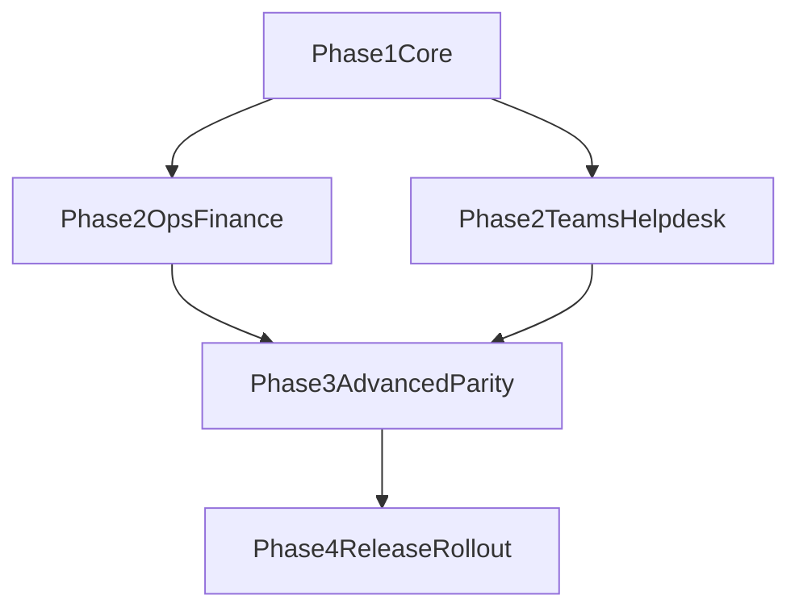

# Phase 2-4 Parity Roadmap

This roadmap sequences remaining modules to reach Android parity after Phase 1 pilot.

## Prioritization Rules

- Prioritize modules with highest daily business impact.
- Deliver shared primitives once (forms, comments, attachments, approvals).
- Keep high-risk admin and complex reporting for later waves.

## Phase 2 (Operations and Finance)

Target: 10-16 weeks.

### Scope

- Manufacturing and job cards:
  - operational status workflows,
  - checklist capture,
  - field updates with offline queue.
- Finance:
  - invoice list/detail/status transitions,
  - order-linked finance actions.
- Teams workflows:
  - meeting notes list/detail/edit,
  - assignment links to tasks/projects.
- Helpdesk:
  - ticket list/detail/create/update.

### Exit Criteria

- Field workflows usable with intermittent connectivity.
- High-priority operational updates sync reliably.
- Finance status transitions pass business UAT.

## Phase 3 (Advanced Parity and Hardening)

Target: 8-14 weeks.

### Scope

- Reports:
  - top mobile-relevant operational and commercial reports.
- Leave and HR:
  - requests, approvals, balances, role-aware actions.
- Advanced sync and offline:
  - delta sync refinement,
  - conflict resolution rules and UX.
- Performance and reliability hardening:
  - startup time and list rendering optimization.

### Exit Criteria

- Mobile report consumption supports in-scope management decisions.
- Leave approval chain matches web business rules.
- Offline conflict handling validated in UAT scenarios.

## Phase 4 (Release Maturity and Full Rollout)

Target: 3-6 weeks.

### Scope

- Security and compliance review.
- Store readiness (assets, policy checks, release checklist).
- Production rollout waves by user cohorts.
- Post-launch stabilization and SLA monitoring.

### Exit Criteria

- Store-distributable release approved internally.
- No high-severity launch blockers.
- Monitoring and support process active for mobile production.

## Dependencies Map

## Governance Cadence

- Weekly:
  - parity burn-down review,
  - defect trend and API reliability review.
- Bi-weekly:
  - stakeholder demo by module wave.
- Per phase gate:
  - go or no-go based on exit criteria.

